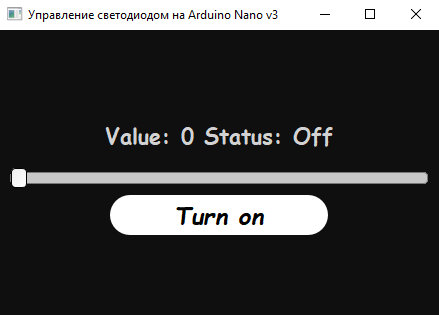

<h1> ArduinoLEDControl </h1>
<h2>Приложение для управления светодиодом на <i>Arduino NANO v3</i> </h2>



<h3>Ползунок управляет яркостью светодиода, кнопка - вкл/выкл </h3>

<h3>Перед запуском установить все библиотеки</h4>
```
pip install -r requirements.txt
```
